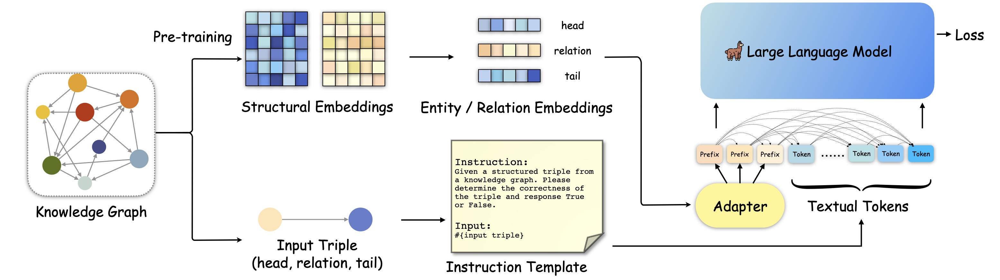

# Making Large Language Models Perform Better in Knowledge Graph Completion

[](https://github.com/zjukg/KoPA/main/LICENSE)
[](http://tcci.ccf.org.cn/conference/2023/)
[](https://pytorch.org/)
 - [Making Large Language Models Perform Better in Knowledge Graph Completion
](https://arxiv.org/abs/2310.06671)

> Large language model (LLM) based knowledge graph completion (KGC) aims to predict the missing triples in the KGs with LLMs and enrich the KGs to become better web infrastructure, which can benefit a lot of web-based automatic services. However, research about LLM-based KGC is limited and lacks effective utilization of LLM's inference capabilities, which ignores the important structural information in KGs and prevents LLMs from acquiring accurate factual knowledge. In this paper, we discuss how to incorporate the helpful KG structural information into the LLMs, aiming to achieve structrual-aware reasoning in the LLMs. We first transfer the existing LLM paradigms to structural-aware settings and further propose a knowledge prefix adapter (KoPA) to fulfill this stated goal. KoPA employs structural embedding pre-training to capture the structural information of entities and relations in the KG. Then KoPA informs the LLMs of the knowledge prefix adapter which projects the structural embeddings into the textual space and obtains virtual knowledge tokens as a prefix of the input prompt. We conduct comprehensive experiments on these structural-aware LLM-based KGC methods and provide an in-depth analysis comparing how the introduction of structural information would be better for LLM's knowledge reasoning ability.

## 🌈 Model Architecture



## 🔬 Dependencies
Our code is developed based on [alpaca-lora](https://github.com/tloen/alpaca-lora). Please build the Python environment following the instruction in Alpaca-lora.

## 📕 Training & Test

- run KoPA tuning
```shell
export WANDB_DISABLED=true
wandb offline
CUDA_VISIBLE_DEVICES=0 nohup python finetune_kopa.py \
    --base_model 'YOUR LLM PATH' \
    --data_path 'data/UMLS-train.json' \
    --output_dir 'YOUR SAVE PATH' \
    --num_epochs 3 \
    --lora_r 32 \
    --learning_rate 3e-4 \
    --batch_size 12 \
    --micro_batch_size 12 \
    --num_prefix 1 \
    --kge_model 'data/UMLS-rotate.pth' \
    --lora_target_modules='[q_proj,k_proj,v_proj,o_proj]' > log.txt &
```
You may need to fill the LLM path and save path before running.

- run inference
```shell
CUDA_VISIBLE_DEVICES=0 python inference_kopa.py
```


## 🤝 Cite:
Please condiser citing this paper if you use the code from our work.
Thanks a lot :)

```bigquery
TBD
```
